# système machine learning 

## EXERCICE 1 : Installation de Docker et vérification de l’environnement
#### Vérification de l’installation :
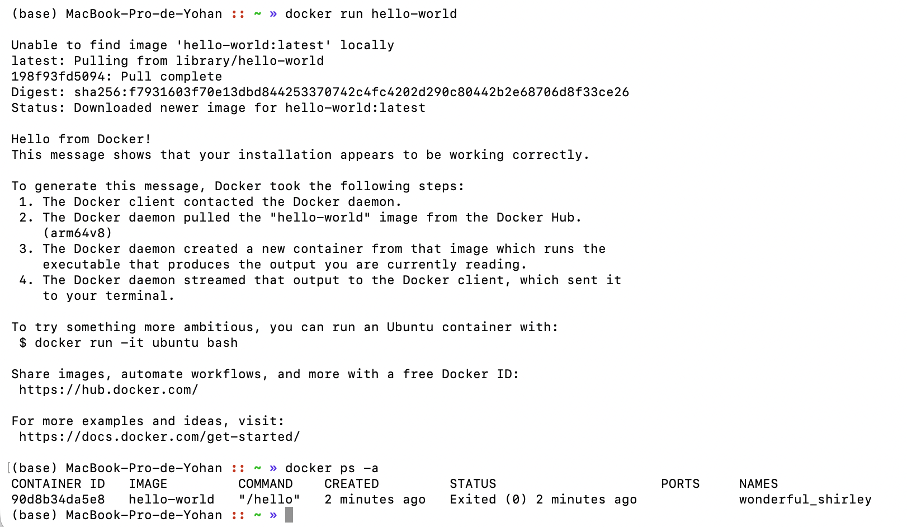

---------------------
## EXERCICE 2 : Premiers pas avec Docker : images et conteneurs
#### 2.A
Une image Docker est un modèle immuable d’un environnement : elle est construite à partir d’un Dockerfile, contient le système de fichiers, le code, les dépendances et la config. Tu peux la voir comme une classe en POO.
Un conteneur Docker, c’est une instance en cours d’exécution de cette image : il a ses propres processus, son propre système de fichiers et son réseau, et on peut le démarrer, l’arrêter, le redémarrer, le supprimer, etc. C’est l’équivalent de l’objet créé à partir de la classe.

#### 2.B

#### 2.C
Lance un seul processus dedans : echo "Bonjour depuis un conteneur Alpine". Le echo affiche la phrase, puis se termine avec un code de sortie 0. Comme le seul processus du conteneur est terminé, le conteneur s’arrête immédiatement, son statut devient Exited.
Un conteneur Docker vit uniquement tant que son processus principal tourne. Ici, c’est juste un echo rapide, donc le conteneur apparaît dans docker ps -a avec Status: Exited  après le lancement.

#### 2.D
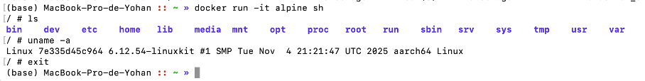

En lançant la commande docker run -it alpine sh, je suis entré dans un conteneur Alpine avec un shell interactif. La commande ls montre un petit système de fichiers Linux isolé (bin, etc, home, lib, root, usr, var, etc.), distinct de celui de ma machine. La commande uname -a confirme que le conteneur s’exécute sur un noyau Linux aarch64 fourni par l’environnement Docker, et quand je tape exit, le shell se ferme, le conteneur s’arrête et je reviens sur mon terminal de l’hôte.

---------------------

## Exercice 3 : Construire une première image Docker avec une mini-API FastAPI
### Étape 1 — Compléter le fichier app.py
#### Question 3.a

### Étape 2 — Compléter le Dockerfile
#### Question 3.b
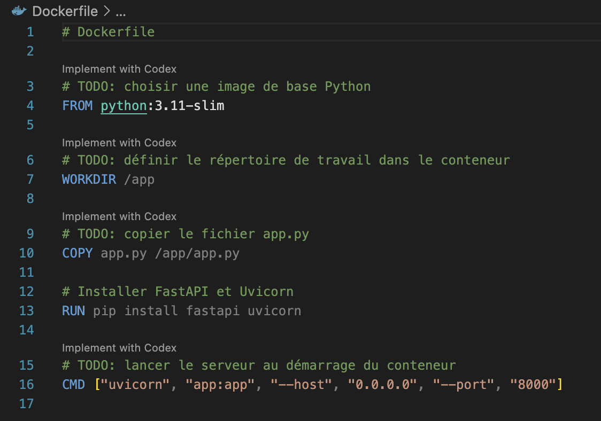

### Étape 3 — Construire l'image Docker
#### Question 3.c

----

## Exercice 4 : Exécuter l’API FastAPI dans un conteneur Docker

### Étape 1 — Lancer le conteneur
#### Question 4.a
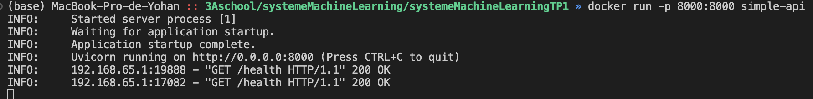

### Étape 2 — Tester l’endpoint /health
#### Question 4.b

### Étape 3 — Observer les conteneurs en cours d’exécution
#### Question 4.c
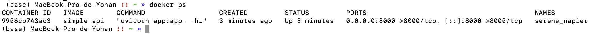

Dans la sortie de docker ps, le conteneur de l’application correspond à la ligne utilisant l’image simple-api. Son nom est serene_napier, l’image utilisée est simple-api, et le port 8000 de la machine hôte est mappé vers le port 8000 du conteneur (0.0.0.0:8000→8000/tcp et [::]:8000→8000/tcp).

#### Question 4.d

Après avoir arrêté le conteneur, il n’apparaît plus dans docker ps parce que cette commande n’affiche que les conteneurs en cours d’exécution. En revanche, docker ps -a liste tous les conteneurs connus de Docker, y compris ceux qui sont stoppés ou terminés (status Exited). La différence principale est donc que docker ps montre uniquement les conteneurs “vivants”, tandis que docker ps -a montre l’historique complet des conteneurs, qu’ils soient actifs ou non.

----

## Exercice 5 : Démarrer un mini-système multi-conteneurs avec Docker Compose

### Étape 1 — Préparer la structure des fichiers

### Étape 2 — Compléter le fichier docker-compose.yml

#### Question 5.b
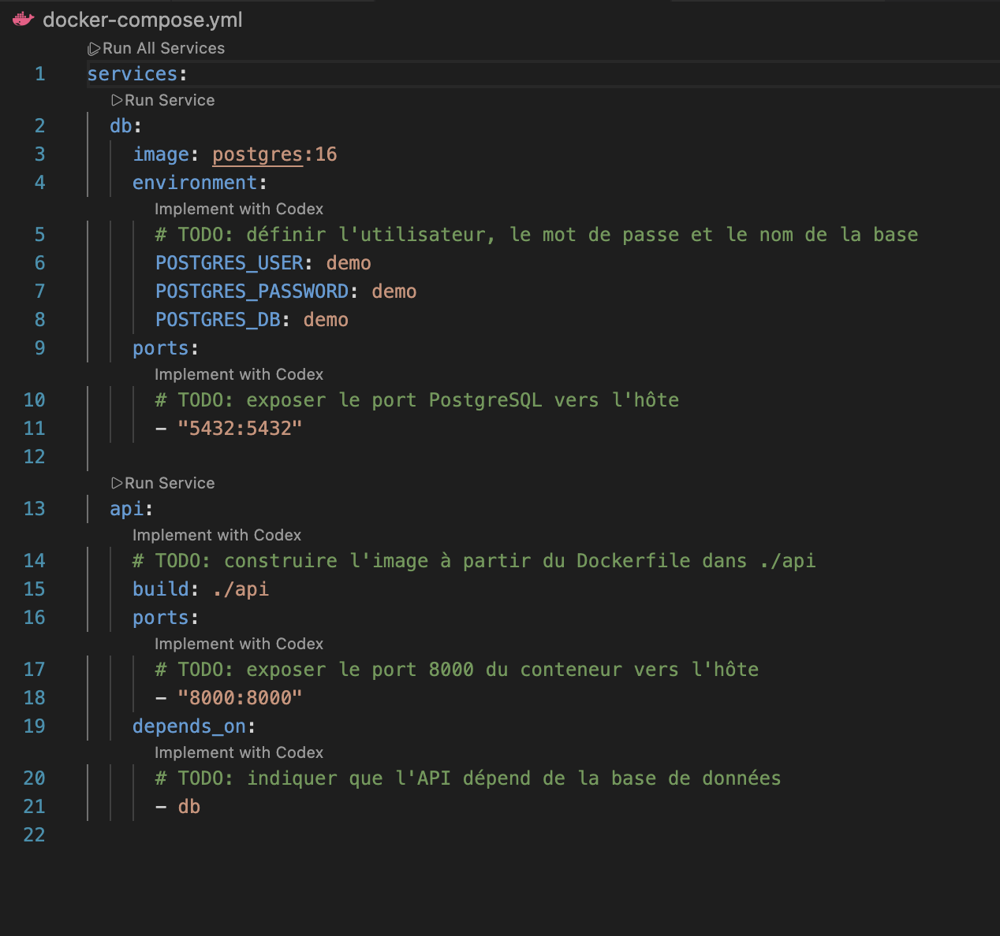

#### Question 5.c

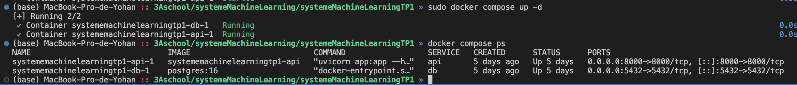

### Étape 4 — Tester à nouveau l’endpoint /health

#### Question 5.d

### Étape 5 — Arrêter proprement les services

#### Question 5.e
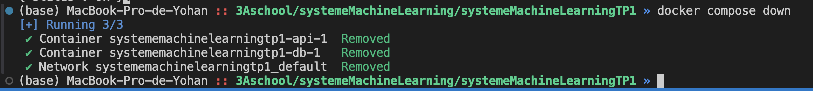

docker compose down arrête l’ensemble des conteneurs définis dans le fichier docker-compose.yml, puis supprime aussi par défaut le réseau créé pour ce projet, et éventuellement d’autres ressources associées. C’est donc une commande “globale” au stack. À l’inverse, docker stop id ne concerne qu’un seul conteneur identifié par son ID. On utilise donc docker compose down pour arrêter proprement toute l’application, et docker stop pour gérer ponctuellement un conteneur isolé.

## Exercice 6 : Interagir avec la base de données PostgreSQL dans un conteneur

### prérequis :
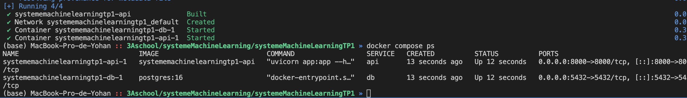

### Étape 1 — Se connecter au conteneur PostgreSQL

#### Question 6.a
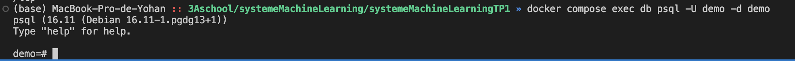

La commande docker compose exec db psql -U demo -d demo permet d’exécuter psql directement dans le conteneur PostgreSQL.

exec : exécute une commande à l’intérieur d’un conteneur déjà en marche ;
db : nom du service PostgreSQL défini dans le docker-compose.yml (cible le bon conteneur) ;
-U demo : indique l’utilisateur PostgreSQL à utiliser (ici « demo ») ;
-d demo : spécifie la base de données à laquelle se connecter (ici « demo »).

### Étape 2 — Exécuter quelques commandes SQL simples

#### Question 6.b

La commande SELECT version(); retourne PostgreSQL 16.11 .
La commande SELECT current_database(); confirme que nous sommes bien connectés à la base de données demo.

### Étape 3 — Comprendre la connexion depuis d'autres services

#### Question 6.c

Dans Docker Compose, tous les services définis dans le fichier docker-compose.yml sont connectés à un même réseau virtuel, et chaque service est joignable par son nom de service. Dans notre stack, la base PostgreSQL est le service db, donc un autre service Docker dans le même docker-compose peut s’y connecter avec : hostname db, port 5432, utilisateur demo, mot de passe demo, base demo (URL postgresql://demo:demo@db:5432/demo).
Pour un conteneur lancé “à l’extérieur” de ce docker-compose, il faudrait soit le connecter explicitement au même réseau Docker avec l’option --network <nom_du_reseau_create_par_compose>, soit utiliser le port exposé sur l’hôte (par exemple host.docker.internal:5432) avec les mêmes identifiants demo/demo.

### Étape 4 — Nettoyer

#### Question 6.d

L’option -v indique à docker compose down de supprimer aussi les volumes associés aux services. Concrètement, cela efface les données persistées dans ces volumes (par exemple le contenu de la base PostgreSQL) en plus d’arrêter et supprimer les conteneurs et le réseau.

## Exercice 7 : Déboguer des conteneurs Docker : commandes essentielles et bonnes pratiques

### Étape 1 — Afficher les logs d’un service
#### Question 7.a
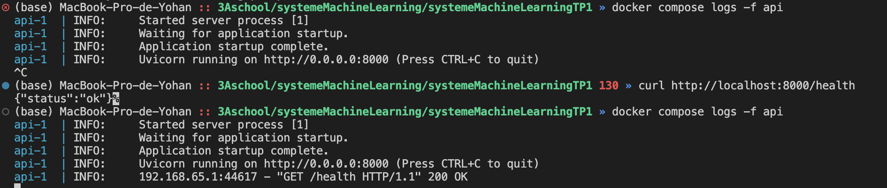

Quand l’API démarre correctement, les logs indiquent que le serveur Uvicorn se lance : “Started server process [1]”, “Application startup complete”, puis “Uvicorn running on http://0.0.0.0:8000”. Lorsqu’une requête est envoyée sur /health, une nouvelle ligne apparaît avec l’adresse IP et le port du client, par exemple 192.168.65.1:44617 - "GET /health HTTP/1.1" 200 OK. Cette IP correspond à la machine hôte vue depuis le conteneur, sur un port source aléatoire, et la requête passe par le port 8000 de l’hôte qui est mappé vers le port 8000 du conteneur.

### Étape 2 — Entrer dans un conteneur en cours d’exécution
#### Question 7.b

La commande docker compose exec api sh ouvre un shell interactif à l’intérieur du conteneur api. On voit alors le contenu du répertoire de travail (app.py, pycache) et la commande python --version confirme que le conteneur utilise bien Python 3.11.14. 

### Étape 3 — Redémarrer un service
#### Question 7.c

Un redémarrage est utile quand l’API se bloque ou se comporte étrangement, après une mise à jour du code ou de la configuration, ou encore pour repartir sur un état propre sans recréer tout le conteneur ni la base de données.

### Étape 4 — Conteneur qui ne démarre pas : diagnostic

introduction de l'erreur dans le fichier python : variable app renommé appi.

#### Question 7.c - rebuild
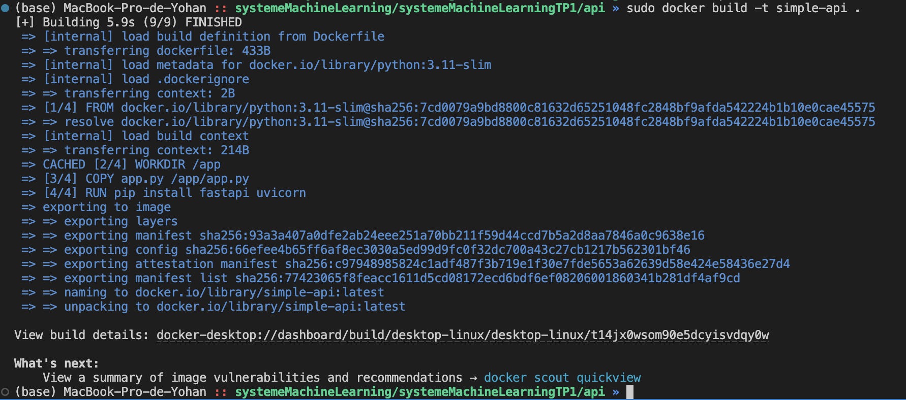

...

Nous pouvons clairement voir l'erreur dans les logs "Did you mean appi ?" et corriger le problème.

###  Étape 5 — Supprimer des conteneurs et images

#### Question 7.e

Nettoyer régulièrement son environnement Docker permet de libérer de l’espace disque occupé par des conteneurs arrêtés et des images plus utilisées, qui peuvent s’accumuler très vite au fil des tests. Cela évite de saturer le stockage, de ralentir la machine, et permet de garder un environnement plus clair et plus simple à maintenir.

## Exercice 8 : Questions de réflexion et consignes pour le rendu

### Questions de réflexion
#### Question 8.a

Un notebook Jupyter n’est pas adapté au déploiement d’un modèle en production car il repose sur une exécution manuelle et interactive, donc difficilement automatisable contrairement à un stack comme celui du TP (où les services doivent tourner en continu dans des conteneurs, exposer une API, redémarrer automatiquement, etc.). En plus, l’environnement n’est pas vraiment reproductible : le notebook dépend de l’état de la session (cellules exécutées dans un certain ordre, variables déjà en mémoire) et des libs installées localement, alors qu’en production on a besoin d’une image Docker figée, versionnée, que l’on peut relancer à l’identique sur n’importe quelle machine.

#### Question 8.b

Docker Compose est essentiel lorsqu’on manipule plusieurs services car il permet de décrire toute l’architecture (API, base de données, réseau, variables d’environnement…) dans un seul fichier, puis de tout démarrer ou arrêter avec une simple commande (docker compose up / down). Dans le TP, on a vu qu’il suffit de lancer docker compose up -d pour démarrer à la fois l’API FastAPI et PostgreSQL déjà configurés pour communiquer entre eux, ce qui est beaucoup plus simple et reproductible que de gérer chaque conteneur à la main.