# système machine learning TP2
Deliere Yohan
## Exercice 1 : Mise en place du projet et du rapport

#### question 1.a - État initial du dépôt
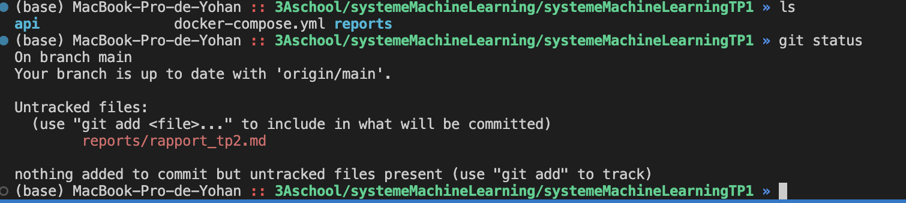
seulement le nouveau rapport pour le tp2 n'est pas encore sur le dépôt.

#### question 1.b - Créer la structure minimale pour le TP2
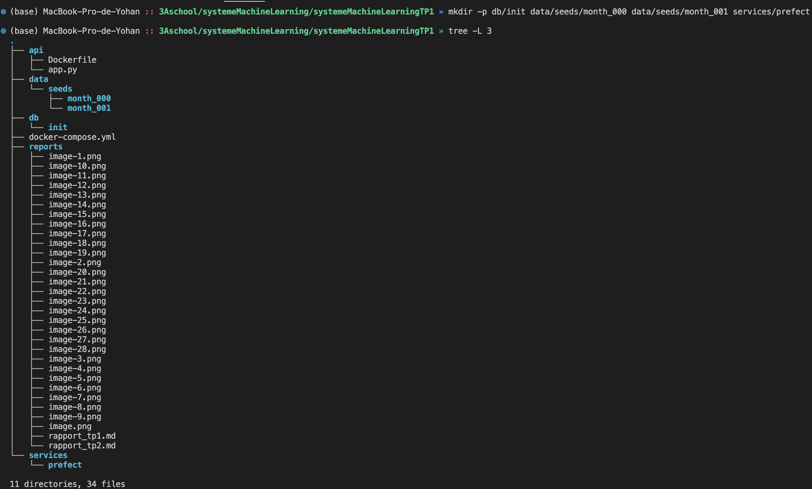


#### question 1.c - Télécharger et extraire les données month_000 et month_001
Structure des données 
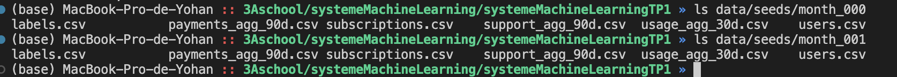

## Exercice 2 : Base de données et docker-compose
#### question 2.a - Créer le schéma de base de données
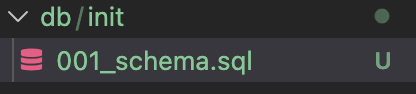

#### question 2.b - Créer et comprendre le fichier .env

Un fichier .env dans un projet Docker sert à stocker les variables d’environnement (mots de passe, URL, configs…) séparées du code, pour pouvoir configurer facilement les services et éviter de mettre ces valeurs en dur dans les Dockerfile ou le docker-compose.yml.

#### question 2.c - Mettre à jour docker-compose.yml
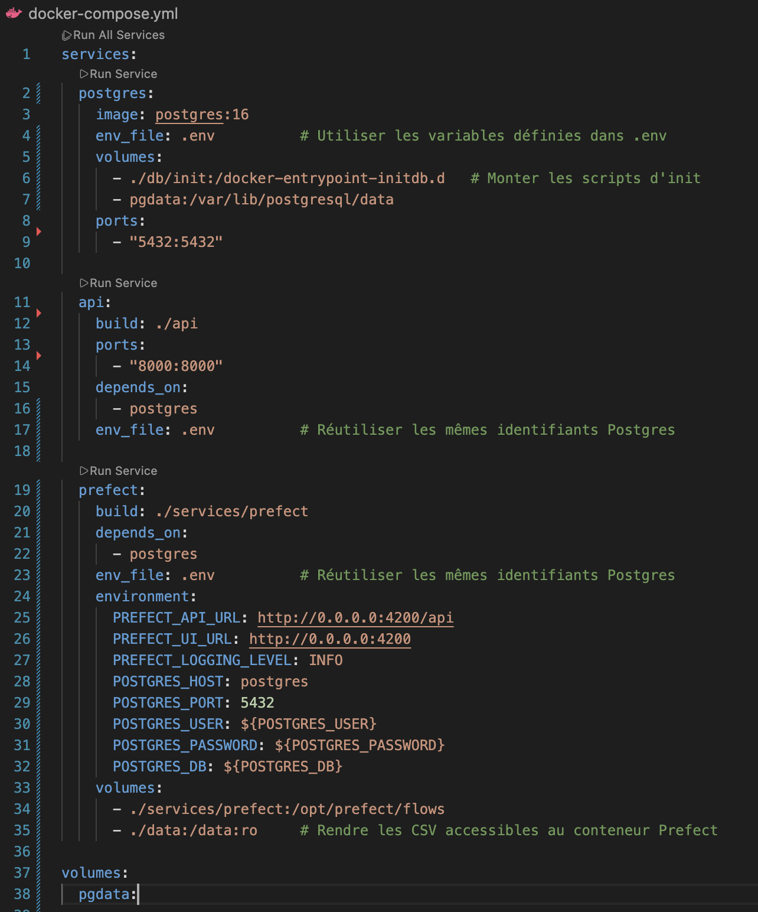

#### question 2.d - Démarrer Postgres et vérifier les tables créées
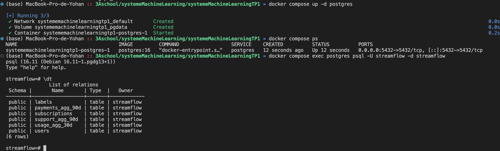
Chaque table de la base correspond au type de fichier CSV, et reçoit les données de tous les mois ingérés. Par exemple, la table users recevra d’abord les lignes de month_000/users.csv puis celles de month_001/users.csv, idem pour subscriptions, usage_agg_30d, payments_agg_90d, support_agg_90d et labels avec leurs fichiers CSV respectifs pour month_000 et month_001.

## Exercice 3 : Upsert des CSV avec Prefect (month_000)

#### question 3.a - Créer le service Prefect : services/prefect/Dockerfile et services/prefect/requirements.txt

Le conteneur prefect joue le rôle d’orchestrateur du pipeline d’ingestion : il exécute et planifie les flows Prefect (chargement des CSV, écriture dans Postgres, validations Great Expectations, snapshots…), en centralisant le suivi des tâches, leurs dépendances et leur état d’exécution via le serveur Prefect et son worker.

#### question 3.b - Créer le fichier services/prefect/ingest_flow.py (version TP)
La fonction upsert_csv lit d’abord un fichier CSV avec pandas, fait quelques conversions de types (dates, booléens), puis crée une table temporaire dans PostgreSQL où elle insère toutes les lignes du CSV. Ensuite, elle exécute une requête SQL INSERT … SELECT … FROM tmp avec ON CONFLICT sur la clé primaire : si la ligne n’existe pas, elle est insérée, si elle existe déjà, toutes les colonnes non clés primaires sont mises à jour (SET col = EXCLUDED.col). Enfin, la table temporaire est supprimée et la fonction renvoie un petit message indiquant combien de lignes ont été upsert.

#### question 3.c -  Lancer Prefect et l’ingestion de month_000

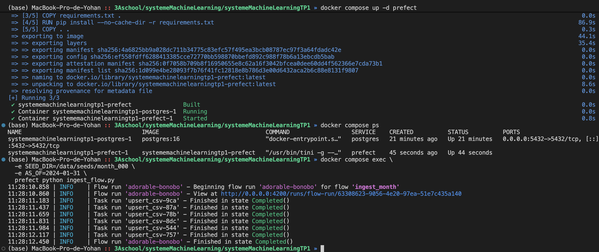

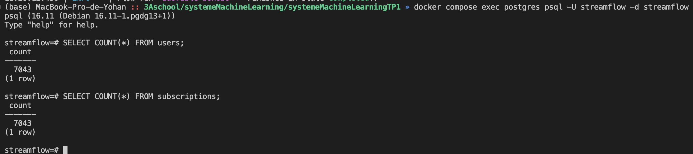

Combien de clients avons-nous après month_000 ? nous en avons 7043

## Exercice 4 : Validation des données avec Great Expectations
#### question 4.a - Compléter la fonction validate_with_ge
La fonction validate_with_ge joue le rôle de garde-fou qualité dans le pipeline d’ingestion. Après avoir inséré ou mis à jour les données dans PostgreSQL, elle lit la table correspondante, applique des règles Great Expectations (colonnes attendues, non-nullité de user_id, valeurs numériques ≥ 0, etc.) et exécute une validation. Si une expectation échoue, elle lève une exception et fait échouer le flow Prefect, ce qui évite de continuer le pipeline (par exemple vers les snapshots) avec des données incohérentes ou corrompues.

#### question 4.b - Relancer l’ingestion pour month_000 avec validation
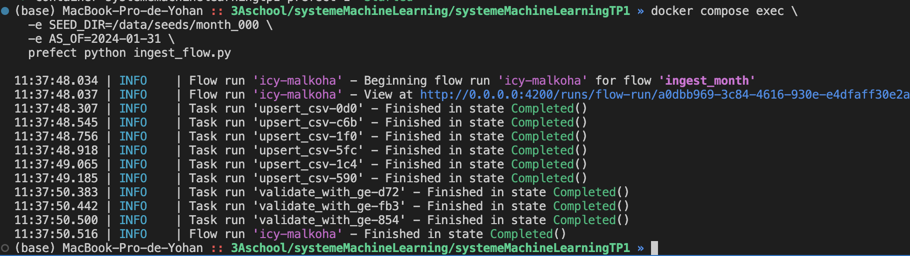

#### question 4.c - Pourquoi ces bornes et comment protègent-elles le modèle ?
##### Validation des données

Pour la table `usage_agg_30d`, nous avons ajouté plusieurs règles Great Expectations, par exemple :

```python
gdf.expect_column_values_to_be_between("watch_hours_30d", min_value=0)
gdf.expect_column_values_to_be_between("avg_session_mins_7d", min_value=0)
gdf.expect_column_values_to_be_between("unique_devices_30d", min_value=0)
gdf.expect_column_values_to_be_between("skips_7d", min_value=0)
gdf.expect_column_values_to_be_between("rebuffer_events_7d", min_value=0)
```

Nous imposons que ces agrégats soient tous supérieurs ou égaux à 0, car il n’a pas de sens métier d’avoir un nombre d’heures de visionnage, un temps moyen de session ou un nombre de devices / événements négatif. Des valeurs négatives indiqueraient probablement un problème d’export (erreur de jointure, bug dans le calcul des agrégats, type mal interprété, etc.).
Ces bornes jouent le rôle de garde-fou : si des données impossibles (par exemple watch_hours_30d < 0) apparaissent, la validation échoue et le flow Prefect est interrompu. Cela évite d’entraîner ou de scorer un modèle de machine learning avec des données corrompues, ce qui pourrait dégrader fortement la qualité des prédictions ou masquer des problèmes en production.


## Exercice 5 : Snapshots et ingestion month_001
#### question 5.a

La fonction snapshot_month capture l'état actuel des tables opérationnelles pour l'archiver dans des tables historiques ; le paramètre as_of sert à horodater ces données, figeant ainsi la vision exacte du système telle qu'elle était à la fin du mois concerné.

#### question 5.b 
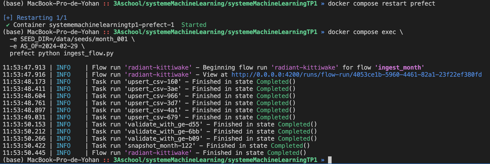


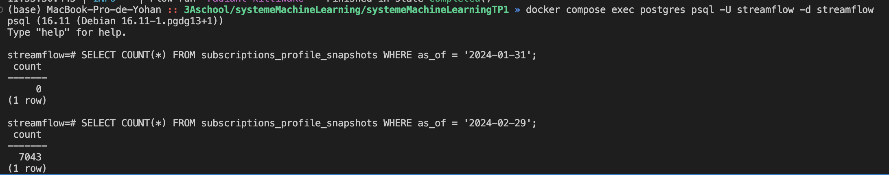
nous n'avons pas fait de snapshot pour 2024-01-31, le chiffre est donc à zero.

Après la création d'une snapshot pour cette date, on remarque que le fichier subscription ne change pas du mois à l'autre (également vérifier avec la commande diff sur les fichiers sources) et que les snapshots sont donc identiques.

#### question 5.c
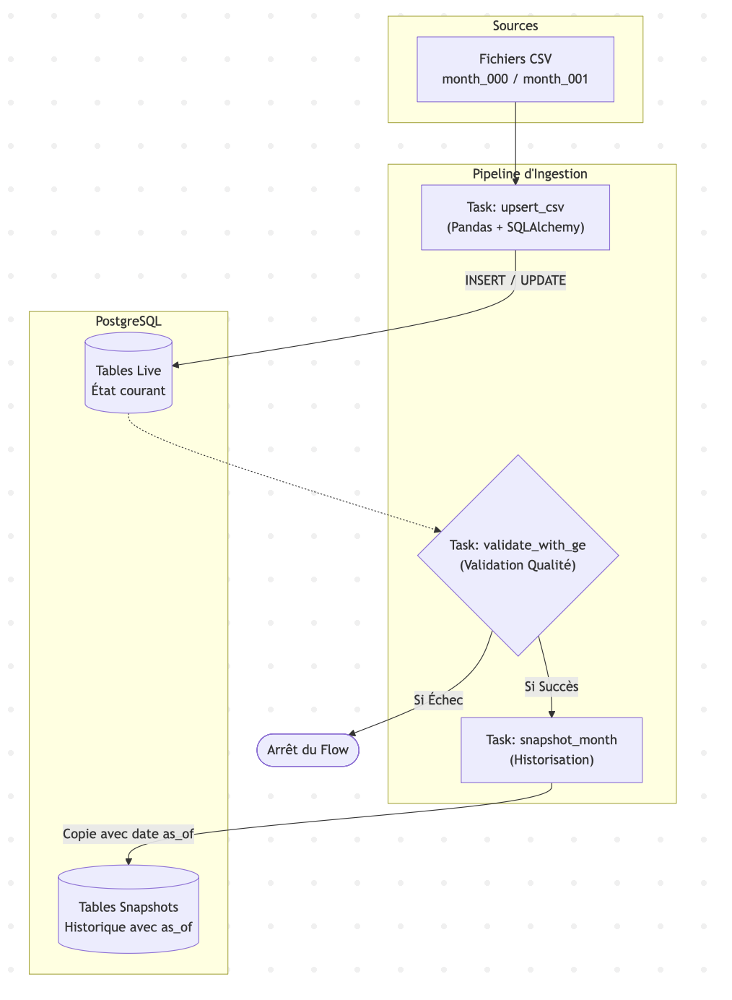


Les tables "live" (opérationnelles) sont mutables : elles ne reflètent que l'état actuel des données. Si un utilisateur change de forfait ou d'adresse aujourd'hui, l'ancienne information est écrasée et perdue à jamais. Pour entraîner un modèle prédictif, nous avons besoin d'historique pour comprendre l'évolution du comportement (par exemple, "quel était son usage avant qu'il ne se désabonne ?"). S'entraîner sur la table live reviendrait à essayer de prédire le passé avec les informations d'aujourd'hui, ce qui est un non-sens temporel.

Data Leakage et Reproductibilité

Data Leakage (Fuite de données) : Les snapshots agissent comme une barrière temporelle. En utilisant un snapshot à la date t, nous avons la garantie mathématique qu'aucune information future (date t+1) n'est incluse dans le dataset. Sans cela, le modèle pourrait "tricher" en voyant des résultats qu'il n'est pas censé connaître (ex: savoir qu'un client a résilié alors qu'on essaie de prédire s'il va résilier).

Reproductibilité : Les snapshots sont immutables. Si nous devons ré-entraîner le modèle dans 6 mois pour comparer ses performances, nous pourrons régénérer exactement le même dataset d'entraînement en filtrant sur le as_of historique. Avec des tables live, les données auraient changé entre-temps, rendant toute comparaison scientifique impossible.


#### réflexion personnelle

j'ai constaté que les valeurs restaient strictement identiques, ce qui m'a d'abord fait douter de la bonne exécution de ma fonction upsert et de la clause ON CONFLICT. Pensant à un bug silencieux, j'ai investigué en comparant directement les fichiers sources CSV via la commande diff. Cette analyse a révélé que le fichier subscriptions.csv était en réalité identique d'un mois à l'autre pour ces utilisateurs, alors que le fichier usage_agg_30d.csv montrait bien des variations. Cette expérience a souligné l'importance de vérifier la volatilité des données sources avant de remettre en cause la logique du code d'ingestion.