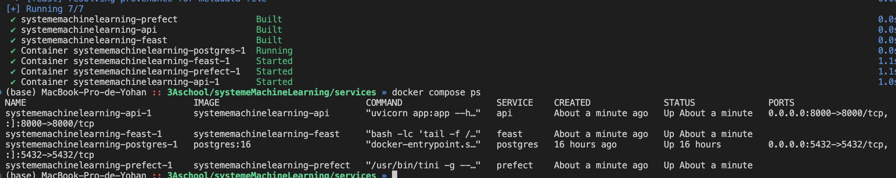
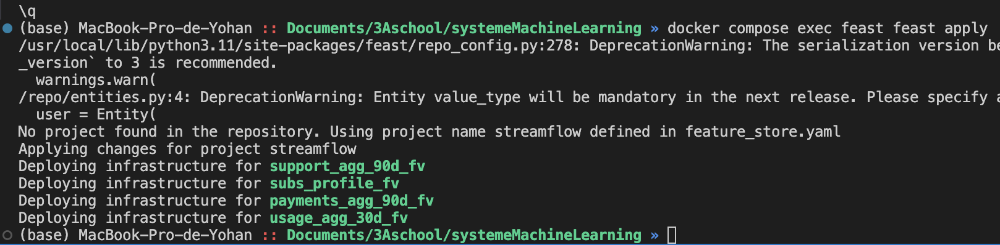
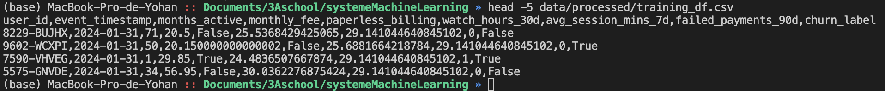
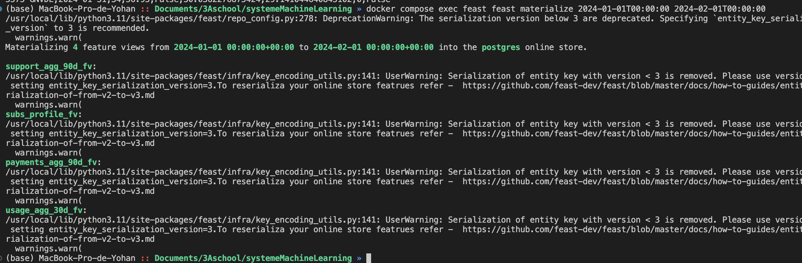
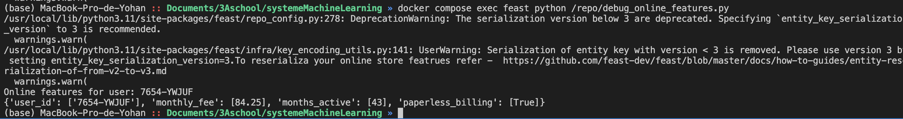
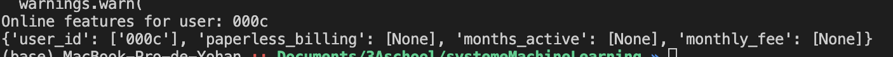
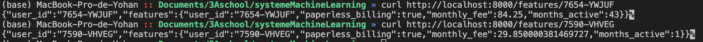

# Contexte

Nous disposons d'un jeu de données complet structuré autour de snapshots mensuels couvrant deux périodes distinctes, ce qui permet d'observer l'évolution temporelle de la base clients. Ce socle principal est enrichi par le croisement de plusieurs tables dimensionnelles : les profils utilisateurs (démographie, segmentation), les données d'usage (fréquence, fonctionnalités activées), l'historique financier via les abonnements et les paiements, ainsi que les interactions avec le service support (tickets, réclamations). Cette consolidation offre une vue à 360° permettant d'analyser à la fois le comportement, la valeur et la satisfaction des utilisateurs sur la durée.

# Mise en place de Feast

docker running : 


Le conteneur feast héberge l'environnement d'exécution Python requis pour le Feature Store, la configuration et les définitions de features étant montées directement dans le répertoire /repo. Il agit comme une interface d'administration permettant d'exécuter, via la commande docker compose exec, les opérations de gestion du cycle de vie des données telles que feast apply (pour l'enregistrement des définitions) et feast materialize (pour la synchronisation vers le store en ligne).

# Définition du Feature Store


```python
from feast import Entity

# Définition de l'entité principale "user"
user = Entity(
    name="user",                    # Nom logique de l'entité
    join_keys=["user_id"],          # Clé de jointure correspondant à la colonne Postgres
    description="Utilisateur de la plateforme StreamFlow"
)
```

Une Entity dans Feast définit l'objet métier fondamental auquel les features sont rattachées, agissant comme une clé primaire logique pour l'indexation et la récupération des données. Pour le projet StreamFlow, le choix de user_id comme clé de jointure est stratégique car il constitue l'identifiant unique et invariant traversant l'ensemble du schéma relationnel existant (tables d'utilisateurs, d'abonnements et snapshots mensuels). Cette cohérence garantit que le Feature Store peut aligner parfaitement les données historiques et temps réel provenant de sources disparates sans ambigüité lors de la constitution des vecteurs de features.

docker compose exec feast feast apply :


La commande feast apply analyse les fichiers de définition Python (entités, sources, vues) pour valider le schéma et mettre à jour le registre central de métadonnées (registry.db). Elle assure ainsi la synchronisation entre votre code et l'infrastructure du Feature Store, rendant les nouvelles features immédiatement disponibles pour la récupération de données historiques ou le déploiement en ligne.

# Récupération offline & online

- construire un entity_df pointant vers les utilisateurs présents dans les snapshots à la date AS_OF = 2024-01-31 ;
- utiliser Feast pour récupérer les features correspondantes via get_historical_features ;
- joindre ces features avec les labels de churn ;
- sauvegarder le jeu de données final dans data/processed/training_df.csv.

élaboration du code qu'on peut trouver dans services/perfect/build_training_dataset.py

commande head sur training_df reussi :


Dans le cadre de la construction du dataset d'entraînement (retrieval offline), Feast garantit la cohérence temporelle (point-in-time correctness) en synchronisant la colonne event_timestamp fournie dans le entity_df avec le champ de référence des sources de données (timestamp_field="as_of"). Il effectue une jointure "as-of" qui récupère, pour chaque user_id, la valeur de feature la plus récente valide au moment de l'événement, sans jamais inclure de données postérieures. Ce mécanisme assure que le modèle s'entraîne sur une vision historiquement exacte du passé, éliminant tout risque de fuite de données (data leakage).


Matérialisation & récupération online :



tester get_online_features avec le code python de debug : 


Si l'on interroge un user_id qui ne possède pas de features matérialisées (soit parce qu'il n'existe pas, soit parce qu'il est hors de la fenêtre de temps synchronisée), Feast ne lève pas d'erreur mais renvoie des valeurs None (nulles) pour les colonnes de features demandées, signalant ainsi l'absence de données dans le store en ligne.

exemple de None :



API
curl reussi :



# Réflexion

Ce endpoint interroge le Online Store de Feast, qui est alimenté par les mêmes définitions de features (Feature Views) que celles utilisées pour générer le dataset d'entraînement historique. En garantissant que la logique de transformation et la source de données sont strictement identiques entre l'environnement d'apprentissage (offline) et l'environnement de production (online), on élimine les incohérences d'implémentation qui sont la cause principale du training-serving skew.