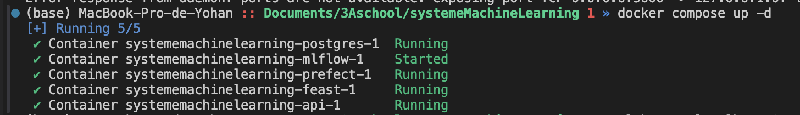
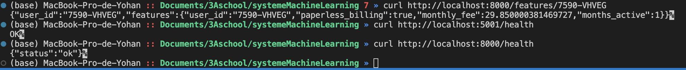
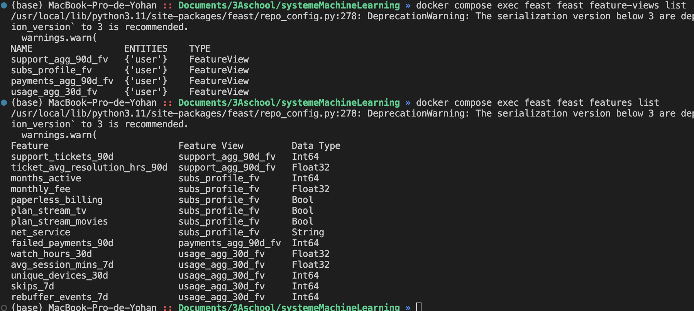
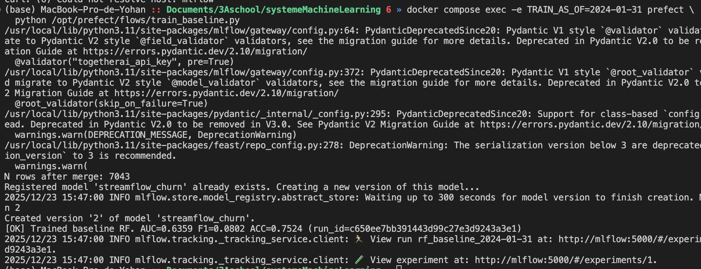
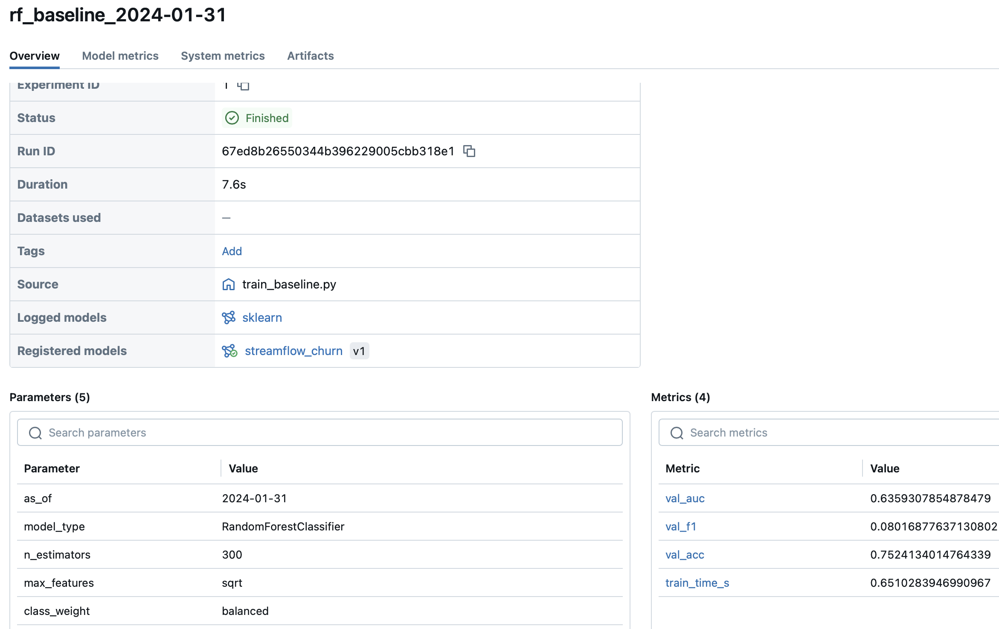
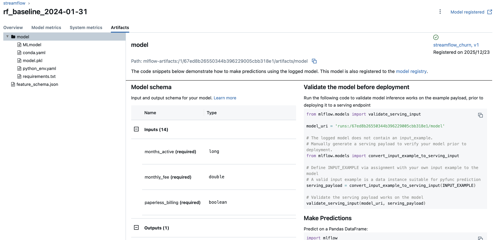
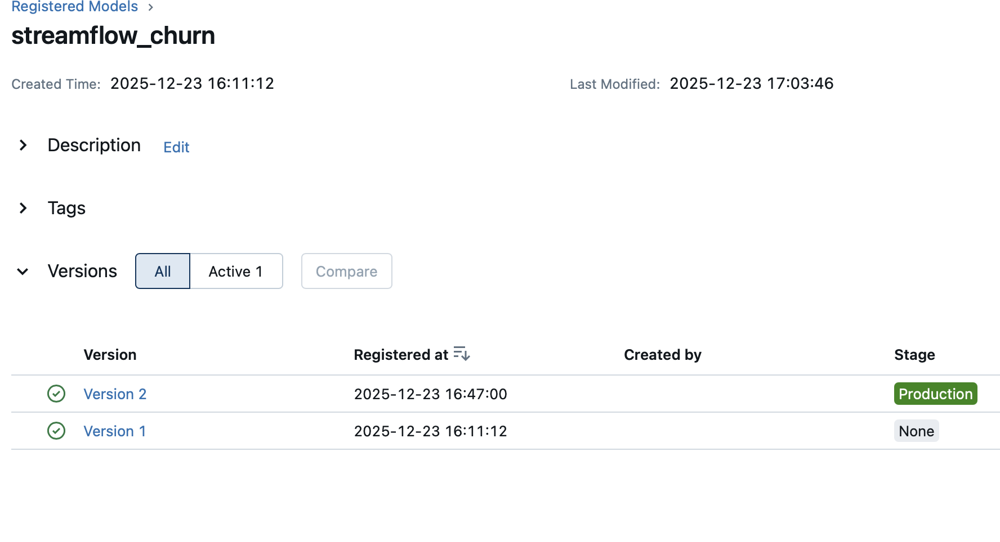
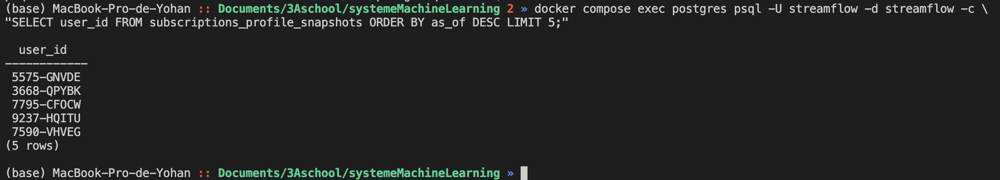
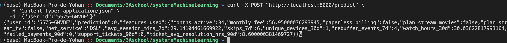
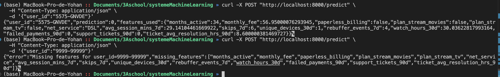

# TP4

## Exercice 1 : Mise en route + rappel de contexte (sanity checks + où on en est dans la pipeline)

changement du port sur 5001 pour Mlflow car un process systeme MacOS utilise déjà le 5000

## Exercice 2 

Le script lance un entraînement “end-to-end” traçable : il lit la date AS_OF (snapshot) et les identifiants Postgres/MLflow depuis des variables d’environnement, construit un entity_df (user_id + event_timestamp) à partir de subscriptions_profile_snapshots, récupère les labels de churn, puis utilise Feast (get_historical_features) pour assembler un dataset point-in-time correct avec les features déclarées dans tes FeatureView. Ensuite, il merge features + labels sur (user_id, event_timestamp), détecte les colonnes catégorielles (dtype object) et numériques, construit une pipeline sklearn avec OneHotEncoder pour les cat et passthrough pour les num, entraîne un RandomForestClassifier (avec random_state fixé), évalue sur un split train/val, et logge le tout dans MLflow (params, métriques, artefact JSON du schéma). Enfin, il définit une ModelSignature (schemas d’inputs/outputs) et enregistre le modèle dans le Registry ; on logge la pipeline (pipe) et pas uniquement clf, car le modèle en production doit embarquer exactement le même preprocessing (sinon mismatch de colonnes/encodage).

Pour mon run : j’ai utilisé AS_OF = 2024-01-31 (passé via TRAIN_AS_OF). Le nombre de lignes de mon dataset d’entraînement après le merge est de 7043 (verifié avec un len(df)). La colonne catégorielle détectée (cat_cols) est ["net_service"] (c’est la seule feature de type String dans la liste Feast), et le reste est numérique/booléen. Sur la validation, j’obtiens AUC = 0.6359, F1 = 0.0802 et ACC = 0.7524 ; le temps d’entraînement est de 7.6 sec sur mlflow.

Dans un pipeline MLOps orienté reproductibilité, on fixe AS_OF pour figer le contexte temporel : mêmes snapshots, mêmes features Feast “as-of”, mêmes labels, et surtout pas de fuite de données (pas de features du futur). Ça permet de rerunner exactement l’entraînement, d’expliquer une perf, et de comparer des modèles sur une base identique. On fixe aussi random_state car le split train/val et certains algos (comme RandomForest) ont des composantes stochastiques : sans seed, deux runs “identiques” peuvent produire des modèles et métriques différentes. Avec une seed, on rend les écarts attribuables à de vrais changements (données, features, hyperparams) et on facilite le debug, les comparaisons en CI, et les rollbacks.

## Exercice 3 : Explorer l’interface MLflow et promouvoir un modèle

#### tableau de bord mlflow 

#### overview :

####  artifacts :

####  model registry :

La promotion via le Model Registry (stages None puis Staging puis Production) est préférable car elle découple l’entraînement du déploiement : on ne déploie pas “un fichier”, on déploie une version de modèle identifiée et liée à un run (code, paramètres, métriques, artefacts). Elle apporte de la traçabilité et de l’audit (qui a promu quoi, quand, pourquoi), et évite les erreurs classiques de chemins locaux ou de “dernier fichier modifié”. Les stages imposent un process (validation en Staging avant Prod) et facilitent la gouvernance en équipe. En production, on peut revenir en arrière facilement (rollback vers une version précédente) sans bricoler des fichiers. Enfin, cela rend le déploiement reproductible et compatible CI/CD : l’app pointe vers “le modèle en Production”, pas vers un chemin fragile.

## Exercice 4 : Étendre l’API pour exposer /predict (serving minimal end-to-end)

je récupère un id d'un user :

#### commande curl 

Pointer l’API vers models:/streamflow_churn/Production permet de charger la version “officielle” du modèle décidée via le Model Registry, au lieu d’un fichier local fragile. Le stage Production référence une version précise, liée à un run (paramètres, métriques, artefacts, signature), ce qui garantit traçabilité et audit. Cela évite les erreurs de chemins et les divergences entre machines/conteneurs (un .pkl local peut ne pas exister, ou ne pas être le bon). C’est aussi compatible avec un cycle de vie MLOps : on peut promouvoir/rollback une version sans redeployer l’API, juste en changeant le stage dans l’UI. Charger depuis un artifact de run (“run:/…”) force l’API à connaître un run_id et contourne la gouvernance (pas de notion de “Production”). Enfin, MLflow gère les dépendances/format du modèle et standardise le chargement, ce qui rend le déploiement plus robuste.

## Exercice 5 : Robustesse du serving : cas d’échec réalistes (sans monitoring)

#### "error":"Missing features for user_id=9999-99999"

En serving, beaucoup d’échecs viennent des features plutôt que du modèle. Premier cas : entité absente, le user_id demandé n’existe pas dans l’online store, donc Feast renvoie des valeurs nulles (ou manquantes) et l’API devrait refuser proprement avec une erreur explicite. Deuxième cas : online store incomplet ou obsolète, la matérialisation n’a pas été faite, a échoué, ou n’est pas à jour (stale). Résultat, certaines features attendues sont null ou incohérentes, même pour un user existant. On détecte ces problèmes tôt en mettant des garde-fous : vérification des NaN, liste des features manquantes dans la réponse, et éventuellement validation de types/ranges (ex : monthly_fee >= 0, months_active non négatif) avant d’appeler le modèle.

## Exercice 6 : Réflexion de synthèse (ingénierie MLOps)

MLflow garantit la traçabilité des entraînements en stockant, pour chaque run, les paramètres, métriques et artefacts, et en liant le modèle loggé à ce run. Il garantit aussi une identification claire des modèles servis via le Registry : un modèle est référencé par nom + version/stage, pas par un fichier local.
Le stage Production signifie que l’API charge au démarrage models:/streamflow_churn/Production, donc la version actuellement promue dans le Registry. Ça permet de promouvoir/rollback un modèle sans changer le code ni les chemins, et impose un minimum de gouvernance (pas de fichiers arbitraire).
La reproductibilité peut encore casser si (1) les données/features changent (DB, matérialisation Feast), (2) le code/FeatureViews évolue, ou (3) l’environnement/config varie (versions de libs, n_jobs, ordre des lignes sans ORDER BY, variables d’env).