# TP5

## Exercice 1 : Démarrer la stack pour l'observabilité
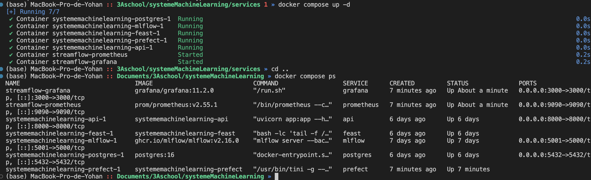

Noms des conteneurs : 

- streamflow-prometheus
- systememachinelearning-api-1
- systememachinelearning-feast-1
- systememachinelearning-mlflow-1
- systememachinelearning-postgres-1
- systememachinelearning-prefect-1

##### Pourquoi Prometheus scrape api:8000 et pas localhost:8000 ?
Parce que dans Docker, localhost désigne le conteneur Prometheus lui-même, alors que api est le nom du service sur le réseau Docker qui résout vers le conteneur de l’API (donc Prometheus peut l’atteindre via api:8000).

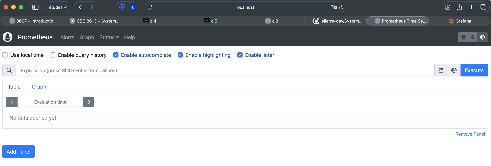

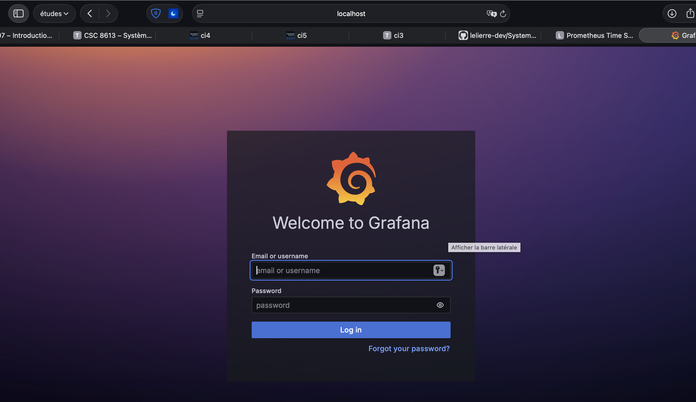

## Exercice 2 : Instrumentation de FastAPI avec de métriques Prometheus

Premier appel à /metrics : les métriques custom sont bien exposées ; api_requests_total vaut 3 et l’histogramme api_request_latency_seconds affiche déjà des buckets (_count=2).

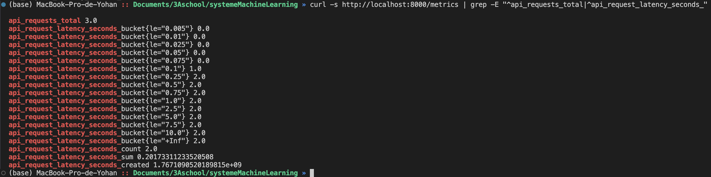

Après 3 appels à /predict, api_requests_total passe de 3 à 6 et l’histogramme est mis à jour (_count=5, buckets non nuls), ce qui confirme la mesure du volume et de la latence.

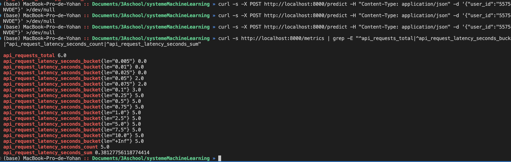

Un histogramme est plus utile qu’une moyenne car il montre la répartition des latences (buckets).
La moyenne peut cacher quelques requêtes très lentes.
Avec l’histogramme, on peut estimer des percentiles (p95/p99) et voir si la “queue” se dégrade.
En production, quelques lenteurs suffisent à dégrader l’expérience même si la moyenne reste correcte.

## Exercice 3 : Exploration de Prometheus (Targets, Scrapes, PromQL)

capture d’écran de la page Status → Targets montrant la target de l’API en UP.
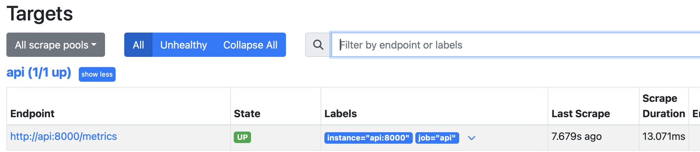

 capture d’écran d’un graphe Prometheus correspondant à une requête PromQL
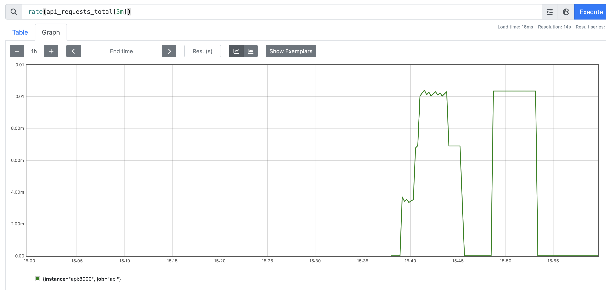

## Exercice 4 : Setup de Grafana Setup et création d'un dashboard minimal

###### Observation de l’impact du trafic vers l’API sur le dashboard :

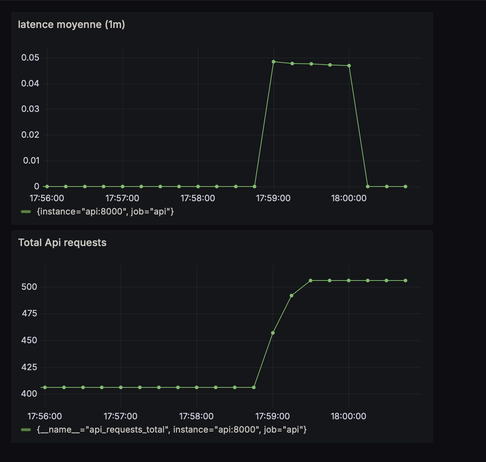

avec les requêtes : 
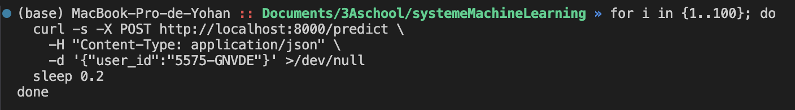

###### editeur : Setup de Grafana Setup et création d'un dashboard minimal
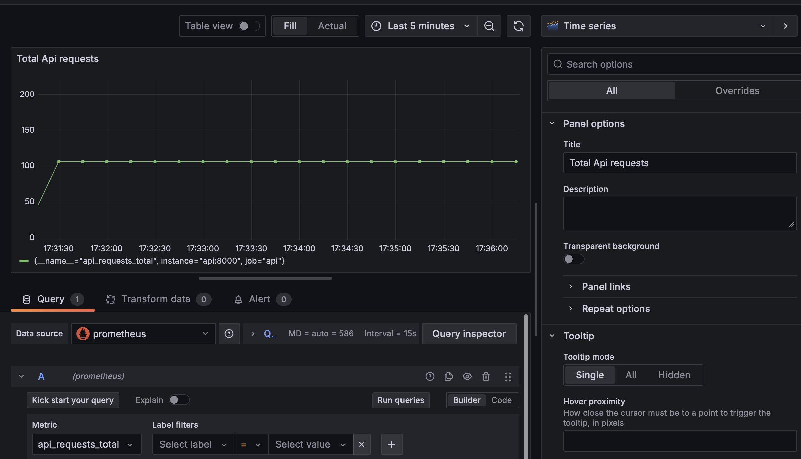

Ces métriques surveillent la santé technique. Elles montrent si l'API est rapide, si elle sature ou si elle crash. C'est parfait pour détecter les problèmes de serveur et de réseau.

Par contre, elles ne disent rien sur la justesse des résultats. L'API peut répondre en un temps record tout en donnant des prédictions fausses à cause d'un décalage des données (drift). Elles valident que le service tourne, mais pas que le modèle est encore performant.

## Exercice 5 : Drift Detection with Evidently (Month_000 vs Month_001)

lancement du programme. Resultat : no action :

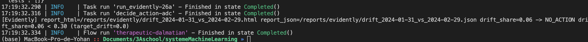

création des rapports :

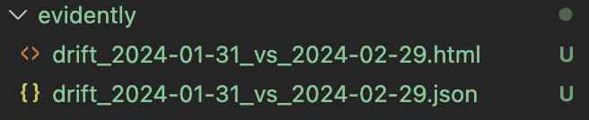

capture d'écran du rapport : 

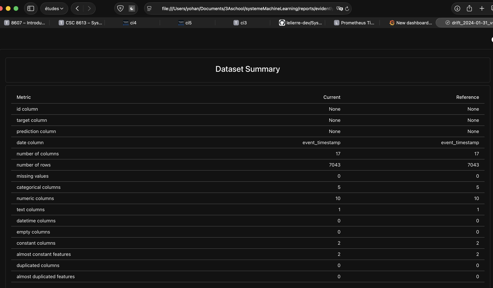

on observe que réference et current sont cohérents entre eux. 

Le covariate drift correspond au fait que les features changent de distribution entre 2024-01-31 et 2024-02-29 (par exemple watch_hours_30d, monthly_fee, net_service). Le modèle reçoit donc des profils utilisateurs différents dans le temps. Le target drift correspond au fait que la cible churn_label change entre ces deux périodes, par exemple, le taux de churn (proportion de churn_label=1) augmente ou diminue d’un mois à l’autre.