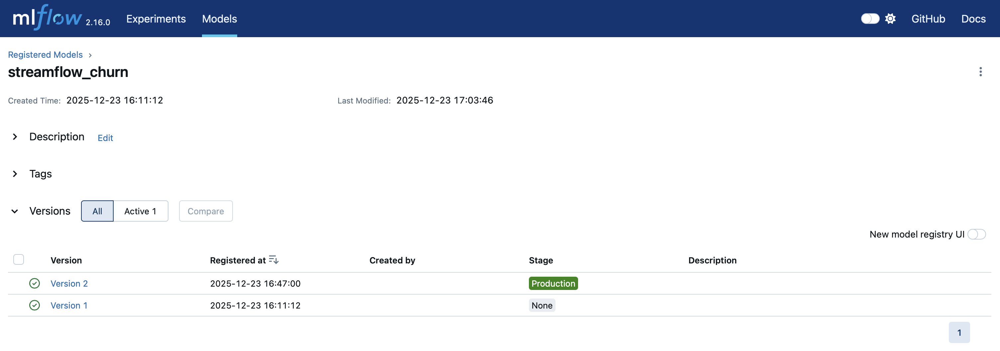
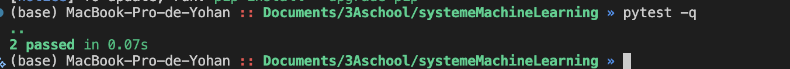
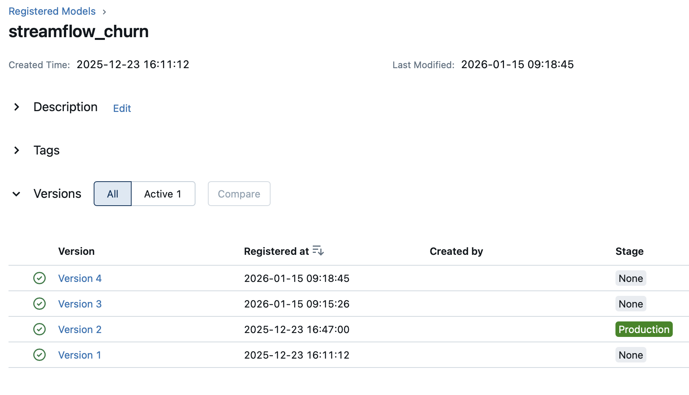
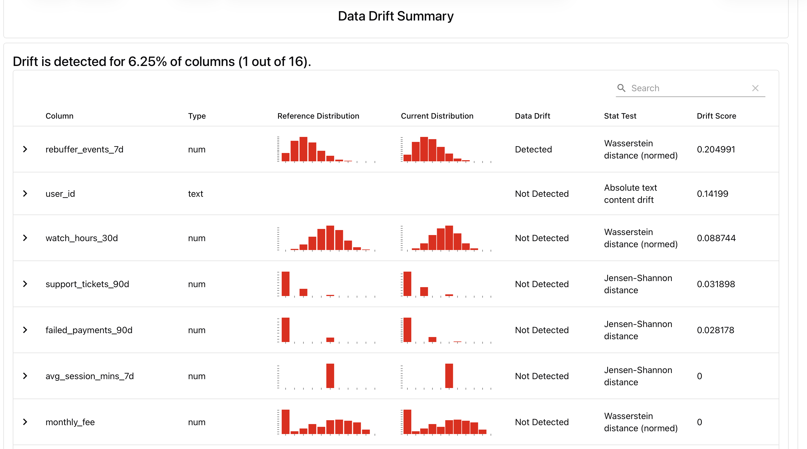

# CI/CD pour systèmes ML + réentraînement automatisé + promotion MLflow

## Exercice 1
```(base) MacBook-Pro-de-Yohan :: Documents/3Aschool/systemeMachineLearning 130 » docker compose ps         
NAME                                IMAGE                            COMMAND                  SERVICE      CREATED       STATUS          PORTS
streamflow-grafana                  grafana/grafana:11.2.0           "/run.sh"                grafana      2 weeks ago   Up 25 minutes   0.0.0.0:3000->3000/tcp, [::]:3000->3000/tcp
streamflow-prometheus               prom/prometheus:v2.55.1          "/bin/prometheus --c…"   prometheus   2 weeks ago   Up 25 minutes   0.0.0.0:9090->9090/tcp, [::]:9090->9090/tcp
systememachinelearning-api-1        systememachinelearning-api       "uvicorn app:app --h…"   api          2 weeks ago   Up 25 minutes   0.0.0.0:8000->8000/tcp, [::]:8000->8000/tcp
systememachinelearning-feast-1      systememachinelearning-feast     "bash -lc 'tail -f /…"   feast        3 weeks ago   Up 25 minutes   
systememachinelearning-mlflow-1     ghcr.io/mlflow/mlflow:v2.16.0    "mlflow server --bac…"   mlflow       3 weeks ago   Up 25 minutes   0.0.0.0:5001->5000/tcp, [::]:5001->5000/tcp
systememachinelearning-postgres-1   postgres:16                      "docker-entrypoint.s…"   postgres     3 weeks ago   Up 25 minutes   0.0.0.0:5432->5432/tcp, [::]:5432->5432/tcp
systememachinelearning-prefect-1    systememachinelearning-prefect   "/usr/bin/tini -g --…"   prefect      2 weeks ago   Up 25 minutes   
(base) MacBook-Pro-de-Yohan :: Documents/3Aschool/systemeMachineLearning » 
```

capture MLflow montrant la version Production :




## Exercice 2 : Ajouter une logique de décision testable (unit test)



On extrait une fonction pure pour pouvoir tester la règle métier de décision de façon isolée, rapide et déterministe, sans dépendre de Prefect/MLflow (réseau, I/O, registry), ce qui rend les tests unitaires plus simples et plus fiables


## Exercice 3 : Créer le flow Prefect train_and_compare_flow (train → eval → compare → promote)

```
latest = client.get_latest_versions(name, None if stage is None else [stage])
Downloading artifacts: 100%|██████████████████████████████████████████████████████████████████████| 5/5 [00:00<00:00, 10.39it/s]
/usr/local/lib/python3.11/site-packages/feast/repo_config.py:278: DeprecationWarning: The serialization version below 3 are deprecated. Specifying `entity_key_serialization_version` to 3 is recommended.
  warnings.warn(
08:18:46.495 | INFO    | Task run 'evaluate_production-808' - Finished in state Completed()
[COMPARE] candidate_auc=0.6312 vs prod_auc=0.8222 (delta=0.0100)
[DECISION] skipped
08:18:46.520 | INFO    | Task run 'compare_and_promote-c83' - Finished in state Completed()
[SUMMARY] as_of=2024-02-29 cand_v=4 cand_auc=0.6312 prod_v=2 prod_auc=0.8222 -> skipped
08:18:46.536 | INFO    | Flow run 'rational-beluga' - Finished in state Completed()
(base) MacBook-Pro-de-Yohan :: Documents/3Aschool/systemeMachineLearning » 
```



Le modèle candidat n’a pas été promu car son AUC de validation (0,6312) était inférieur à celui du modèle Production (0,8222), donc la condition d’amélioration minimale (delta) n’était pas satisfaite.

On utilise un delta pour éviter de promouvoir un modèle pour un gain trop faible (souvent dû au hasard du split/bruit), et ne changer la Production que si l’amélioration est réelle et significative.


## Exercice 4 : Connecter drift → retraining automatique (monitor_flow.py)



```
Downloading artifacts: 100%|███████████████████████████████████████████| 5/5 [00:00<00:00, 10.20it/s]
/usr/local/lib/python3.11/site-packages/feast/repo_config.py:278: DeprecationWarning:

The serialization version below 3 are deprecated. Specifying `entity_key_serialization_version` to 3 is recommended.

08:58:49.156 | INFO    | Task run 'evaluate_production-d21' - Finished in state Completed()
[COMPARE] candidate_auc=0.6312 vs prod_auc=0.8222 (delta=0.0100)
[DECISION] skipped
08:58:49.179 | INFO    | Task run 'compare_and_promote-83b' - Finished in state Completed()
[SUMMARY] as_of=2024-02-29 cand_v=5 cand_auc=0.6312 prod_v=2 prod_auc=0.8222 -> skipped
08:58:49.206 | INFO    | Flow run 'competent-bullmastiff' - Finished in state Completed()
08:58:49.208 | INFO    | Task run 'decide_action-159' - Finished in state Completed()
[Evidently] report_html=/reports/evidently/drift_2024-01-31_vs_2024-02-29.html report_json=/reports/evidently/drift_2024-01-31_vs_2024-02-29.json drift_share=0.06 -> RETRAINING_TRIGGERED drift_share=0.06 >= 0.02 (target_drift=0.0) -> skipped
08:58:49.230 | INFO    | Flow run 'ethereal-guillemot' - Finished in state Completed()
(base) MacBook-Pro-de-Yohan :: Documents/3Aschool/systemeMachineLearning » 
```

Le drift mesuré (0,06) dépasse le seuil (0,02), donc le flow a déclenché un réentraînement, mais le modèle candidat étant moins bon que la Production, il n’a pas été promu.


Exercice 5 : Redémarrage API pour charger le nouveau modèle Production + test /predict

```
(base) MacBook-Pro-de-Yohan :: Documents/3Aschool/systemeMachineLearning » 
curl -s -X POST "http://localhost:8000/predict" \
  -H "Content-Type: application/json" \
  -d '{"user_id":"7590-VHVEG"}' | jq
{
  "user_id": "7590-VHVEG",
  "prediction": 1,
  "features_used": {
    "paperless_billing": true,
    "plan_stream_tv": false,
    "months_active": 1,
    "plan_stream_movies": false,
    "net_service": "DSL",
    "monthly_fee": 29.850000381469727,
    "skips_7d": 4,
    "rebuffer_events_7d": 1,
    "watch_hours_30d": 24.48365020751953,
    "avg_session_mins_7d": 29.14104461669922,
    "unique_devices_30d": 3,
    "failed_payments_90d": 1,
    "support_tickets_90d": 0,
    "ticket_avg_resolution_hrs_90d": 16
  }
}
```

L’API doit être redémarrée car elle charge le modèle au démarrage depuis la production, donc sans redémarrage elle continue d’utiliser l’ancienne version même si une nouvelle a été promue.


Execice 6 : CI GitHub Actions (smoke + unit) avec Docker Compose


